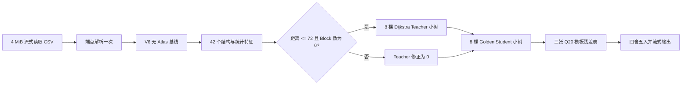

# V8 P2 代码结构与失分原因分析

分析日期：2026-10-02。本文只分析当前正式候选，不修改算法、模型参数或提交二进制。

## 结论摘要

当前 V8 P2 的工程指标已达到本机目标：Linux 静态程序 12,966,280 bytes，百万条五次平均 1.015910 秒，线性投影亿条 101.591 秒；公开 100 万条 C++ 准确度 94.603474，估算总分 94.836188。

但精度瓶颈不是量化误差，也不主要是超长距离。最明确的当前证据是：固定验证集中，Chebyshev 距离不超过 64 的请求只占 17.58%，准确度却只有 87.4154%，贡献了 40.13% 的验证失分，单行平均失分是总体的 2.28 倍。无 Atlas 后缺少局部真实路径结构，是当前与 V6/V7 仍相差约 1.0～1.2 个准确度点的主因。

Dijkstra 方向是可行的，但当前 Teacher 只在“距离不超过 72 且不碰 Block”的 107,999 行上启用，覆盖仅 10.80%。它把固定验证从 94.1962 提升到 94.3062，说明结构 Teacher 有效；但 Teacher 本身不是 Golden，覆盖范围也避开了短距离碰 Block 这一历史难区，所以不能单独填平缺口。

## 当前交付指标与边界

| 指标 | 当前值 | 判断 |
|---|---:|---|
| Linux 静态二进制 | 12,966,280 bytes | 小于 100 MB，余量约 87.03 MB |
| 百万条本机五次均值 | 1.015910 s | 输出哈希一致 |
| 亿条线性投影 | 101.591 s | 小于 120 s，余量约 18.409 s |
| 公开全量 C++ 准确度 | 94.603474 | 达到 94.6 线 |
| 固定 20% 验证准确度 | 94.485992 | 未达到 94.6，差 0.114008 |
| 公开全量与留出差 | 0.117482 | 存在可见的训练分布拟合收益 |
| MAE / RMSE | 29.446 / 49.838 ps | 仍有长尾 |
| P95 / P99 / 最大绝对误差 | 84 / 198 / 773 ps | 极端误差尚未消失 |
| 5% / 10% 相对误差内 | 94.9015% / 98.4541% | 不能解释为“只有 5% 的行完全错” |

101.591 秒是本机百万条结果的线性投影，不是官方平台对 1 亿条的实测。体积与速度“达标”的最终结论仍以平台为准。

## 代码执行结构

### 1. 输入输出层

`p2_runtime/estimate.cpp` 以 4 MiB 分块读取 CSV，端点只解析一次，单线程输出。格式错误会累计为 `invalid_rows` 并以非零状态退出。这里主要解决速度、内存与确定性，不是精度来源。

### 2. 无 Atlas 数值基线

`p2_runtime/p2_estimator.hpp` 构造 `srb_v4::Estimator("", false, true, false, true, Family, 0)`，明确关闭 Atlas，启用 V6 family/Macro10 残差。

底层 `srb_fast.hpp` 并没有在线搜索路径，而是把方向、距离、角度、端口对、端口与距离、区域、位移余数、绝对位移、Block 相对位置和 Gap 前缀代价等统计项相加。`srb_v4.hpp` 再叠加预测区间、边界、Gap 形状、Block 数、端口族对、端口族距离、Macro10 余数和绝对相位残差。因此它是很强的常数时间统计模型，但不是局部路由求解器。

### 3. Teacher 与 Student

运行时先构造 42 个特征。Teacher 和 Student 各保留 8 棵树、每套导出 1,000 个节点：

- Teacher 学习 radius-56 Dijkstra/Atlas 结果相对无 Atlas 基线的结构残差；
- Student 再用固定训练侧 Golden 学习 Teacher 输出相对最终计分标签的残差；
- Teacher 只对 `cheb <= 72 && block_count == 0` 的请求生效；
- Student 对所有请求生效。

这种两阶段设计是正确的边界：Dijkstra 教结构，Golden 教计分口径。问题在于当前 Teacher 的结构标签和覆盖范围都太有限。

### 4. 后置模板记忆

最后使用三张 Q20 `int16` 表：

- `source_family × direction × distance_bin`；
- `source_family × (dx,dy mod 10)`；
- `direction × (dx,dy mod 10)`。

共 57,492 个参数，约 112 KiB 原始 Q20 数据。它们是可泛化模板，不是 `(From, To)` 答案缓存。训练文件中的 `Macro8` 符号名是历史命名；当前索引实际使用 10×10 余数。

## 定量失分定位

### 1. 短距离是当前最集中的坏区

固定验证集的分段如下：

| 模型 | 距离 ≤64 准确度 | 距离 >64 准确度 | 固定验证总体 |
|---|---:|---:|---:|
| V6 无 Atlas 基线 | 86.462407 | 95.846150 | 94.196185 |
| 仅 Dijkstra 小树 Teacher | 87.083438 | 95.847120 | 94.306182 |
| Teacher + Golden Student + 三表 | **87.415373** | **95.994475** | **94.485992** |

短距离只有 35,113 / 199,696 行，即 17.58%，却贡献 40.13% 的验证失分。它不是“样本多所以失分多”，而是单位样本损失显著更高。

这也解释了为什么删除 Atlas 后损失明显：短距离最依赖端口进出、局部资源、转向、绕 Block 和穿 Gap 的真实路径；仅用位移、端口族和周期余数很难区分同一统计桶中的不同路由。

### 2. Atlas 删除带来的结构缺口约为 1 分

- V6（radius-56 Atlas）公开准确度 95.637129；当前 V8 P2 为 94.603474，差 1.033655。
- V7 固定留出为 95.647606；当前固定留出为 94.485992，差 1.161614。

不同版本不完全同口径，不能把差值都归因于 Atlas；但两个对照都稳定指向同一数量级：当前小树与模板只补回了一部分局部路径信息。

### 3. Teacher 覆盖范围过窄

Teacher 在公开 100 万条中仅激活 107,999 行，占 10.80%。代码又明确排除了所有 `block_count > 0` 的请求。

历史 V3 误差分析表明，“短距离且碰 Block”只占 1.95% 样本，却贡献 5.00% 失分，单位损失约为总体 2.56 倍。该数字不是当前 V8 的逐行重算结果，但与当前 Teacher 主动跳过 Block 的实现结合后，可以合理推断：短距离 Block 路由仍是优先核验的剩余热点。

### 4. Block/Gap 特征描述的是包围盒，不是真实路径

当前 `classify()` 把端点闭包矩形与 Block 矩形相交视为命中；Gap 则按起终点坐标是否跨越固定横线/竖线累计。这些特征速度很快，但无法回答：

- 实际最短路从 Block 哪一侧绕行；
- 进入和离开局部资源时用了哪个端口状态；
- 是否存在多个近似等价路径，以及 Golden 选择了哪种规则；
- 直线包围盒相交但真实路由并未接触该 Block，或反过来的情况。

所以“经过更多 Block/Gap”不一定更差，真正困难的是局部路径类别没有被准确辨认。

### 5. 端口交互存在压缩与哈希碰撞

42 个特征中的端口对、端口族对、PRP class 对和 route 对分别被哈希到 251 个桶；496×496 的端口组合会大量碰撞。端口 ID 的归一化数值还隐含了并不存在的顺序关系。

后置三表只使用 source family，没有对称地建模 target family，也没有低秩的 source-target 联合表示。完整端口对记忆虽能抬高公开全量，却把固定验证从 94.4712 降到 94.4697，说明直接扩大稠密表会记住训练组合而不是学习可迁移规律。

### 6. 公开全量收益大于留出收益

最终 Python 全量为 94.603255，固定留出为 94.485992，相差 0.117262；C++ 全量为 94.603474。三张模板相对无后置记忆的收益为：

- 公开全量：94.581555 → 94.603255，增加 0.021700；
- 固定留出：94.471213 → 94.485992，增加 0.014780。

这不是严重过拟合，但证明不能继续以公开全量作为唯一选择标准。若官方 1 亿条确实只是这 100 万条的随机复制，全量分数很有参考价值；若存在新组合，则 94.486 的固定留出更可信。

### 7. 量化和 C++ 导出不是失分主因

最终 Python 全量 94.603255，C++ 全量 94.603474，差值仅 0.000219，且五次输出 SHA-256 完全一致。Q20、四舍五入和导出路径没有造成可见的精度塌陷。

### 8. 单纯增加树数的性价比不足

64+64 棵树的固定验证为 94.586853，比当前高约 0.100861，但旧实现亿条投影约 494 秒；16+16 为 94.496408，旧投影约 174 秒。虽然这些时间来自端点复用优化前，不能直接当作当前速度，但足以说明：堆树只能换来有限增益，且很快越过时间预算。当前缺的是更有辨识度的结构信息，而不是只增加同一批特征上的容量。

## 候选解决方案（本轮不实施）

### 优先级 A：扩大离线 Dijkstra Teacher 的“有效覆盖”

不要把 Dijkstra 放进正式逐条推理；应离线补齐当前缺少的短距离、碰 Block、少量 Gap、边界与稀有端口族样本，并输出比单一距离更丰富的路径摘要，例如首末状态、转向数、实际 Block/Gap 穿越、入口/出口类别和次优路径差值，再蒸馏成小模型。

实施前必须先做一张 `Dijkstra/Atlas vs Golden` 分段误差表。V5 的运行时重建方案只有 92.373770，已经证明“结构最短路”不自动等于最终 Golden；因此 Teacher 只能提供结构监督，最终仍需 Golden 训练侧校准。

### 优先级 A：短距离专用专家

为 `cheb <= 64` 建一个只在高风险桶启用的小专家，并进一步按实际路径摘要、Block 拓扑和端口进出类别分门控。短距离只有约 17.6% 的验证行，允许把有限计算预算集中投放，而不必让所有 1 亿条都承担更多树。

### 优先级 B：以低秩端口表示替代 251 桶哈希

使用共享 source/target embedding 或低秩矩阵分解表示端口交互，并与方向、距离段、周期余数做小规模双线性交互。目标是在稀有端口对上共享统计强度，避免完整端口对表的过拟合，也避免模 251 哈希的不可逆碰撞。

### 优先级 B：紧凑的路径拓扑特征

可从官方架构离线构造很小的 quotient graph/portal 类别，只保存 Block 周边入口、Gap 门、方向切换和局部状态类别，不保存每个位移的 Atlas 距离。正式运行时做固定候选数的状态组合，而不是全图 Dijkstra。该方案应先证明能提高固定留出，再评估是否消耗当前约 18 秒时间余量。

### 优先级 C：按不确定度选择性校准

训练一个小门控预测“当前基线在哪些结构桶容易错”，只对高风险桶启用额外专家。门控输入必须来自架构/端口/位移特征，不能使用 Golden 答案或精确查询 ID。

### 不建议优先做

- 在线逐条 Dijkstra/A*：1 亿条时间不可接受；
- 完整 `(From, To)`、端口对或 `(portA,portB,dx,dy)` 答案表：体积大且固定留出已显示过拟合；
- 直接增加到 64+64 棵树：速度代价远大于精度收益；
- 继续把 P1 原语距离直接当最终估计：P1 公开准确度只有 68.817773；
- 只追公开全量而忽略固定留出：当前已有约 0.1175 分选择偏差。

## 下一轮优化前应先补的诊断

1. 用当前正式 V8 二进制重新导出 100 万条逐行预测，生成与 V3/V7 同格式的 `segment_loss_stats.csv` 和 `top_error_rows.csv`。
2. 单独统计 `teacher_active`、距离 0–16/17–32/33–48/49–64、Block 数、Gap 数、边界、端口对频次和高估/低估方向。
3. 对候选 Dijkstra 扩充集，先测 Teacher 相对 Golden 的分段偏差，再决定哪些标签进入蒸馏。
4. 所有候选只在同一固定 199,696 行验证集上做一次变量消融；公开全量只作复盘，不作唯一选择依据。
5. 进入正式版本的门槛至少包括：固定留出稳定提升、五次输出一致、官方格式零坏行、二进制小于 90 MB 工程线、官方或同环境速度留有安全余量。

## 证据文件

- `srb_prpr_v8/analysis/p2_memory_fast/p2_ablation.json`
- `srb_prpr_v8/analysis/p2_memory_fast/post_memory_ablation.json`
- `srb_prpr_v8/analysis/p2_memory_fast/p2_cpp_score.json`
- `srb_prpr_v8/analysis/p2_memory_fast/runtime_benchmark.json`
- `analysis/error_distribution_v3/README.md`
- `srb_prpr_v8/p2_runtime/p2_estimator.hpp`
- `srb_prpr_v8/p2_runtime/srb_fast.hpp`
- `srb_prpr_v8/p2_runtime/srb_v4.hpp`
